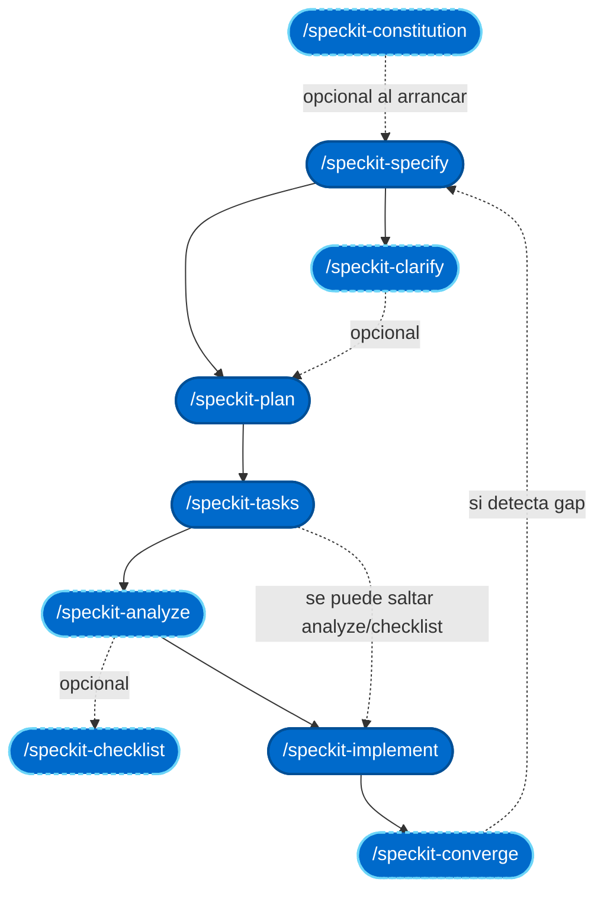

# Flujo Speckit paso a paso

Esta página cataloga los pasos del ciclo Speckit, marca cuáles son obligatorios
y cuáles opcionales, describe qué produce cada uno y da un extracto ilustrativo
aplicado al [caso guía](caso-guia.md). Léela una vez de arriba abajo antes de
recorrer el caso guía; después vuelve como referencia rápida cuando ejecutes tu
propio ciclo.

## Ciclo Speckit en un vistazo



Aristas sólidas = flujo obligatorio (spec → plan → tasks → implement).
Aristas discontinuas = pasos opcionales o retornos de iteración. El bucle
`converge → specify` representa que, si `converge` detecta trabajo no cubierto,
se revisa la spec en lugar de improvisar sobre el implement.

## Pasos del ciclo en orden

Cada paso aparece en el orden en que puede dispararse. La etiqueta al inicio
indica si es **obligatorio** (parte del ciclo mínimo) u **opcional** (útil bajo
un disparador concreto).

### `/speckit-constitution`

**Etiqueta**: opcional · disparador = setup inicial o cambio de política estructural.

**Qué produce**: `.specify/memory/constitution.md`, con principios, restricciones
y flujo de gobierno del proyecto. Es el único artefacto Speckit no ligado a una
feature: vive a nivel de repositorio y aplica a todas las specs.

**Inputs necesarios**: convenciones existentes del proyecto, principios que se
quieren fijar, políticas de merge y calidad.

**Cuándo dispararlo**:

- **Setup inicial** de un proyecto que va a usar Speckit.
- Cuando cambia una política estructural (nuevas versiones de stack fijadas,
  incorporación de una restricción legal, etc.). Se enmienda como
  MAJOR/MINOR/PATCH según impacto.

**Extracto ilustrativo del caso guía**: no aplica (la constitution del repo
formativo ya existe: `.specify/memory/constitution.md` versión 1.0.2). Ver
[greenfield.md](greenfield.md) para un ejemplo de constitution mínima nueva.

### `/speckit-specify`

**Etiqueta**: obligatorio.


**Qué produce**: `specs/<NNN>-<slug>/spec.md`, con secciones `User Scenarios &
Testing`, `Requirements` (Functional Requirements FR-###), `Success Criteria`
(SC-###), `Assumptions`, `Edge Cases`, `Key Entities`. Añade un checklist de
calidad en `checklists/requirements.md`.

**Inputs necesarios**:

- Descripción de la funcionalidad en lenguaje natural (por qué existe, para
  qué usuario, qué debería poder hacer). No hace falta prosa perfecta; el
  comando estructura el resto.
- `.specify/memory/constitution.md` presente (opcional pero muy recomendado).
- `CLAUDE.md` del proyecto para que Speckit herede convenciones.

**Extracto ilustrativo del caso guía** (fragmento de `spec.md`):

```markdown
### User Story 2 - Reproducir el ciclo en su propia máquina (Priority: P1)

Un profesional que ha leído el módulo abre una copia local de la app
`examples/user-crud-modern/`, instala Speckit siguiendo la guía y ejecuta el
ciclo completo del caso guía en su entorno.

**Acceptance Scenarios**:
1. Given el módulo publicado, When el alumno lee los prompts documentados,
   Then puede copiarlos y pegarlos en su terminal Claude Code sin ediciones
   estructurales.
```

Recorrido detallado en [caso-guia.md — Prompt inicial para /speckit-specify](caso-guia.md#prompt-inicial-para-speckit-specify).

### `/speckit-clarify`

**Etiqueta**: opcional · disparador = ambigüedades en `spec.md` que afectan arquitectura, contrato o UX.

**Qué produce**: sección `## Clarifications` dentro de `spec.md`, con formato
`### Session YYYY-MM-DD` y bullets `- Q: … → A: …`. Actualiza secciones
afectadas para eliminar la ambigüedad resuelta.

**Inputs necesarios**: `spec.md` recién creado por `/speckit-specify` con
puntos susceptibles de interpretación múltiple.

**Cuándo dispararlo**:

- El spec contiene decisiones que impactan arquitectura, contrato o experiencia
  de usuario y admiten más de una lectura razonable.
- Aparecen marcadores `[NEEDS CLARIFICATION: …]` o adjetivos vagos ("rápido",
  "seguro") sin métrica.

**Cuándo NO**: preguntas cosméticas (nombre de una variable, orden estético
de las columnas de una tabla). Ver [antipatrones.md — /speckit-clarify cosmético](antipatrones.md#speckit-clarify-cosmetico).

**Extracto ilustrativo del caso guía**:

```markdown
## Clarifications

### Session 2026-09-16

- Q: ¿Cómo se combinan los filtros (`email`, `nameContains`, `createdAfter`)?
  → A: AND por defecto. OR se descarta: enfriaría cache HTTP, complica
    documentación del contrato y ningún caso de negocio actual lo requiere.
- Q: ¿Sensibilidad a mayúsculas en `nameContains`? → A: case-insensitive.
    Coherente con búsquedas de UI habituales; el usuario final no piensa en
    mayúsculas.
```

Preguntas completas y justificaciones en [caso-guia.md — Clarifications propuestas](caso-guia.md#clarifications-propuestas).

### `/speckit-plan`

**Etiqueta**: obligatorio.


**Qué produce**: `plan.md` con `Technical Context`, `Constitution Check` (gate),
`Project Structure`, `Complexity Tracking`. En Phase 0 añade `research.md`; en
Phase 1 añade `data-model.md`, `contracts/` y `quickstart.md`.

**Inputs necesarios**:

- `spec.md` cerrado (idealmente tras `/speckit-clarify` si había ambigüedades).
- Constitution vigente para el `Constitution Check`.

**Extracto ilustrativo del caso guía** (fragmento de `plan.md`):

```markdown
## Technical Context

**Primary Dependencies**: Spring Boot 4, Spring Data JPA con Specifications,
Jakarta Validation, springdoc-openapi.

**Storage**: H2 en memoria (perfil test), PostgreSQL 16 (perfil dev).

**Constraints**:
- Endpoint retro-compatible en URL/verbo; envelope rompe shape de forma
  documentada.
- ProblemDetail (RFC 7807) para errores 4xx.
```

Extracto ampliado en [caso-guia.md — Extracto de plan.md](caso-guia.md#extracto-de-planmd).

### `/speckit-tasks`

**Etiqueta**: obligatorio.


**Qué produce**: `tasks.md` con fases (`Setup`, `Foundational`, una por
`User Story`, `Polish`), tareas numeradas `T001..`, marcadores `[P]` para
paralelismo, labels `[US1]/[US2]/...` por historia, ruta de fichero por tarea.

**Inputs necesarios**:

- `plan.md`, `spec.md`, y todos los artefactos de Phase 1 (`data-model.md`,
  `contracts/`, `quickstart.md`) presentes.

**Extracto ilustrativo del caso guía** (fragmento de `tasks.md`):

```markdown
## Phase 3: User Story 1 — Envelope y filtros básicos (P1) MVP

- [ ] T010 [P] [US1] Crear DTO PagedUserResponse en
      src/main/java/com/example/users/api/PagedUserResponse.java
- [ ] T011 [P] [US1] Crear UserSearchCriteria en
      src/main/java/com/example/users/api/UserSearchCriteria.java
- [ ] T012 [US1] Ampliar UserRepository con Specification en
      src/main/java/com/example/users/repo/UserRepository.java (depende de T010, T011)
- [ ] T013 [US1] Ampliar UserController.list() para aceptar criterios y devolver envelope
```

Extracto ampliado en [caso-guia.md — Extracto de tasks.md](caso-guia.md#extracto-de-tasksmd).

### `/speckit-analyze`

**Etiqueta**: opcional · disparador = features con muchos FR (>15), alto riesgo de deriva o autoría múltiple.

**Qué produce**: informe read-only con `Coverage Summary Table` (FR/SC → tasks),
findings por severidad (CRITICAL/HIGH/MEDIUM/LOW) en categorías Duplication,
Ambiguity, Underspecification, Constitution Alignment, Coverage Gap,
Inconsistency. No modifica ficheros.

**Inputs necesarios**: `spec.md`, `plan.md`, `tasks.md` presentes (post-tasks).

**Cuándo dispararlo**:

- Antes de `/speckit-implement` en features con muchos FR (>15) o alto riesgo
  de deriva entre artefactos.
- Cuando el ciclo lo han escrito varias personas y quieres validar coherencia.
- Cuando has iterado spec/plan varias veces y necesitas confirmar que las
  tareas siguen mapeando a los requisitos.

**Extracto ilustrativo del caso guía**:

```text
| Requirement Key | Has Task? | Task IDs                     | Notes           |
|-----------------|-----------|------------------------------|-----------------|
| FR-005          | Partial   | T006, T011, T026, T034       | Falta bloque en |
|                 |           |                              | caso-guia.md    |
| SC-002          | Partial   | T023                         | Sin cronómetro  |
```

### `/speckit-checklist`

**Etiqueta**: opcional · disparador = dimensiones de calidad no cubiertas por FR/SC (accesibilidad, seguridad, i18n, compliance).

**Qué produce**: `checklists/<name>.md` con criterios que el revisor humano
valida manualmente (por ejemplo `ux.md`, `security.md`, `accessibility.md`).
No confundir con el checklist de calidad de spec que crea `/speckit-specify`
automáticamente.

**Inputs necesarios**: descripción del área de calidad a revisar (ux, security,
docs, etc.). Suele redactarse a mano o con un prompt específico.

**Cuándo dispararlo**:

- La feature tiene dimensiones no cubiertas por FR/SC (accesibilidad,
  compliance, i18n, seguridad).
- Vas a llevarla a revisión con un especialista externo al equipo.

**Extracto ilustrativo del caso guía**: no aplicado (feature interna sin
requisitos de accesibilidad/seguridad no cubiertos por FR). En una API pública
tendría sentido un `checklists/security.md` con OWASP API Top 10.

### `/speckit-implement`

**Etiqueta**: obligatorio.


**Qué produce**: código real bajo `src/`, tests bajo `src/test/` (o donde
corresponda), commits atómicos por tarea o grupo lógico. Actualiza `tasks.md`
marcando `[x]` las tareas completadas.

**Inputs necesarios**:

- `tasks.md` completo y validado.
- Todos los checklists de `checklists/` en verde (gate por defecto).

**Extracto ilustrativo del caso guía** (salida esperada):

```text
Phase 1 Setup: 3/3 completed
Phase 2 Foundational: 2/2 completed
Phase 3 US1 (MVP): 6/6 completed
  ✓ T010 PagedUserResponse.java
  ✓ T011 UserSearchCriteria.java
  ✓ T012 UserRepository amplation
  ✓ T013 UserController.list
  ✓ T014 UserSpecifications
  ✓ T015 GlobalExceptionHandler mapping
[...]
Build: ./mvnw test → BUILD SUCCESS (42 tests, 0 failures, 0 errors)
```

Verificación completa en [caso-guia.md — Verificación](caso-guia.md#verificacion).

### `/speckit-converge`

**Etiqueta**: opcional · disparador = sospecha de gap tras implement o retoma de feature abandonada.

**Qué produce**: análisis del código actual contra la spec, plan y tasks; si
detecta trabajo pendiente (spec dice X, código no lo hace), añade tareas
adicionales a `tasks.md` para cerrar el gap.

**Inputs necesarios**: `spec.md`, `plan.md`, `tasks.md` y código ya
implementado.

**Cuándo dispararlo**:

- Tras `/speckit-implement`, si sospechas que quedó trabajo fuera.
- Cuando retomas una feature abandonada semanas atrás y no recuerdas dónde
  se paró.
- Cuando has integrado cambios de otro branch y quieres re-verificar
  cumplimiento contra spec.

**Cuándo NO**: usarlo como coartada para justificar código escrito sin spec
previa. Ver [antipatrones.md — /speckit-converge como coartada](antipatrones.md#speckit-converge-como-coartada).

**Extracto ilustrativo del caso guía**:

```text
Converge report — spec 005:
- SC-006 verified: no changes under examples/ contracts/ ✓
- FR-015 verified: no .specify/ inside app ✓
- Gap detected: 2 páginas sin sección "Enlaces relacionados"
  → Added T036b to Polish phase
```

## Enlaces relacionados

- [Caso guía](caso-guia.md) — recorrido end-to-end con todos los artefactos.
- [Setup del entorno](../setup/index.md) — instalación de Claude Code y Speckit.
- [CLAUDE.md](../claude-md/index.md) — cómo alimentar el contexto de Speckit.
- [App de ejemplo](../app-ejemplo/index.md) — CRUD sobre el que se ilustra el ciclo.
- [Antipatrones](antipatrones.md) — errores frecuentes en cada paso.

!!! info "Versión de referencia"

    - **Speckit**: 1.0.4
    - **Claude Code**: 2.x (LTS actual)
    - **Verificado**: 2026-09-16
